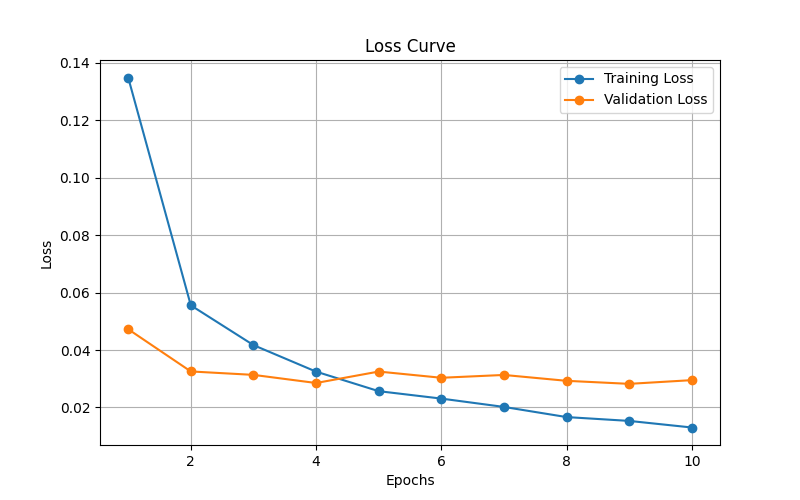

# NumPy Neural Network from Scratch

A deep learning framework built entirely from scratch using only NumPy, no PyTorch or TensorFlow. Every gradient, and every optimizer is implemented and mathematically verified by hand.

## Why

Most people who "know deep learning" have never actually derived or implemented backpropagation themselves - frameworks like PyTorch hide it behind autograd. This project builds that engine from the ground up to understand exactly what's happening under the hood, from a single Linear layer up to a working CNN.

## Architecture
- `nn/layers.py`  Linear, Conv2D, MaxPool2D, Flatten, BatchNorm, Dropout
- `nn/activations.py` - ReLU, Sigmoid, Tanh
- `nn/losses.py` - CrossEntropyLoss, MSELoss
- `nn/optimizers.py` - SGD, Adam, ReduceLROnPlateau
- `nn/model.py` - Sequential container (train/eval mode)
- `nn/metrics.py` - Accuracy, precision, recall(binary + macro-averaged)
- `nn/save_load.py` - save/load model weights
- `data/loader.py` - MNIST loader via Keras
- `train.py` - MLP training, 98.12% test accuracy
- `train_cnn.py` - CNN training, 99.14% test accuracy
- `predict.py` - CNN inference
- `predict_mlp.py` - MLP inference
- `grad_check.py` - gradient verification, Linear 8.88e-12, Conv2D 2.24e-11

## Results

| Model | Test Accuracy | Macro Precision | Macro Recall |
|---|---|---|---|
| MLP (784 → 128 → 64 → 10) | 98.13% | 0.9811 | 0.9813 |
| CNN (no regularization) | 99.02% | 0.9903 | 0.9901 |
| CNN (BatchNorm + Droupout) | 99.36% | 0.9936 | 0.9935 |

Trained on MNIST, 10 epochs, batch size 32, Adam optimizer.

Adding BatchNorm and Dropout to the CNN's fully-connected layers reduced the train/validation loss gap significantly - validation loss plateaued around epoch 4 without regularization but kept improving through epoch 10 with it, alongside a meaningful accuracy gain.



## Verified Correctness

Backpropagation was verified using numerical gradient checking - comparing analytic gradients against finite-difference approximations.

| Layer | Max Gradient Difference | Result |
|---|---|---|
| Linear | 8.88e-12 | PASSED |
| Conv2D | 2.24e-11 | PASSED |

## Usage

```python
from nn.layers import Linear, Conv2D, MaxPool2D, Flatten, BatchNorm, Dropout
from nn.activations import ReLU
from nn.losses import CrossEntropyLoss
from nn.optimizers import Adam, ReduceLROnPlateau
from nn.model import Sequential
from nn.metrics import accuracy

model = Sequential([
    Conv2D(in_channels=1, num_filters=32, filter_size=3),
    ReLU(),
    MaxPool2D(pool_size=2),
    Flatten(),
    Linear(13*13*32, 128),
    BatchNorm(128),
    ReLU(),
    Dropout(p=0.3),
    Linear(128, 10)
])

loss_fn = CrossEntropyLoss()
optimizer = Adam(learning_rate=0.001)
scheduler = ReduceLROnPlateau(optimizer, patience=3)

model.train()
logits = model.forward(x_batch)
loss = loss_fn.forward(logits, y_batch)
dout = loss_fn.backward()
model.backward(dout)
optimizer.step(model.layers)

model.eval()
predictions = np.argmax(model.forward(x_test), axis=1)
print(accuracy(predictions, y_test))
```

## Running

```bash
pip install numpy tensorflow matplotlib tqdm

python train.py        # train MLP
python train_cnn.py    # train CNN
python predict.py      # run inference on saved CNN
python grad_check.py   # verify gradients numerically
```